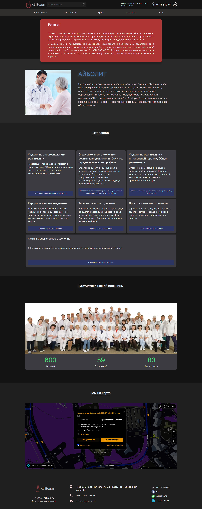
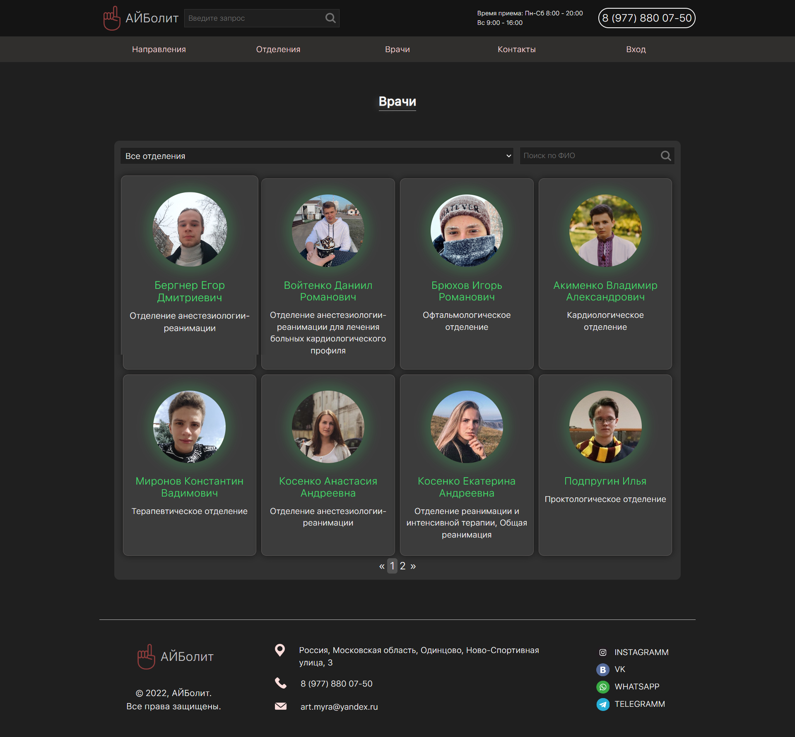
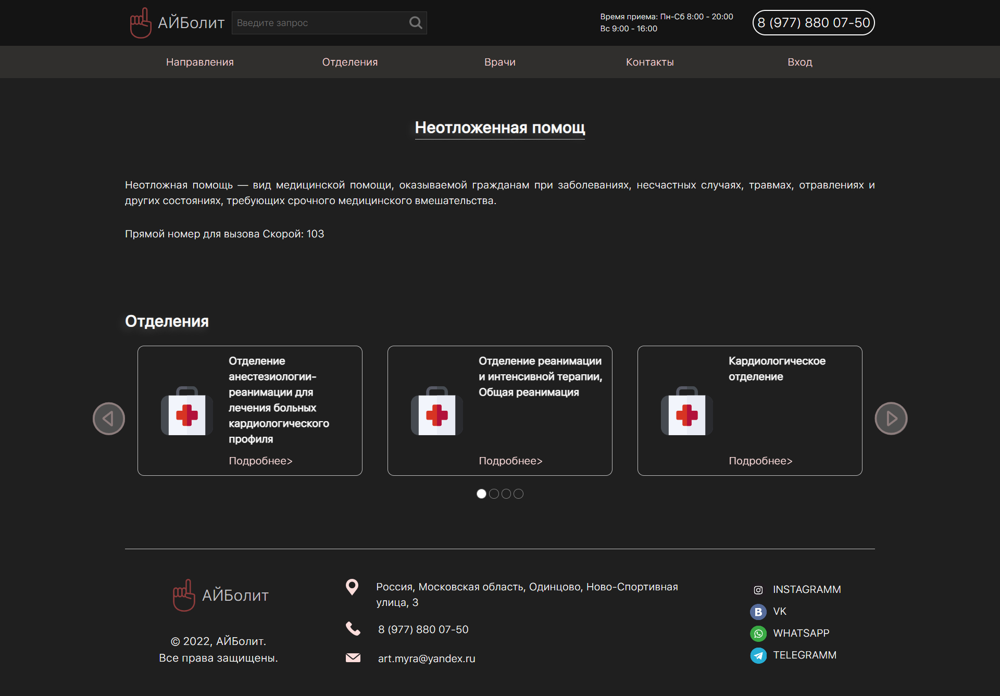

# AiBolit - сайт больницы
_Выпускная квалификационная работа на тему: "Разработка информационной системы для автоматизации деятельности регистратуры в медицинском учреждении"_

---
___Описание___
Данная работа была выполнена мною по окончанию 4 курса по специальности "Прикладная информатика" в колледже МГИМО. В данной работе попытался затронуть большинство технологий, дабы сделать его более "сложным". В данном проекте старался реализовывать на нативных языках.
При разработке:
* Использовал шаблонизацию php
* Использовал ассинхронные запросы ajax 
* Разработал собственное api
* Реализовал MVC паттерн
* Разработал реляционную базу данных MySQl 

[Ссылка на мою ВКР](readme-assets/work.docx)
[Ссылка на демонстрацию сайта](https://youtu.be/y9bE9ZpiKPI)
Год разработки: 2021

___Реализации___
 
* Страницы генерируются на основе данных из базы данных
* Авторизация/регистрация на сайте
* Запись на прием к врачу
* Поиск по врачам (Как по отделениям, так и по ФИО)

---
___Скриншоты___

Главная страница  
  
страница с динамичным списком докторов 
  
Пример генерирующейся страницы  
  